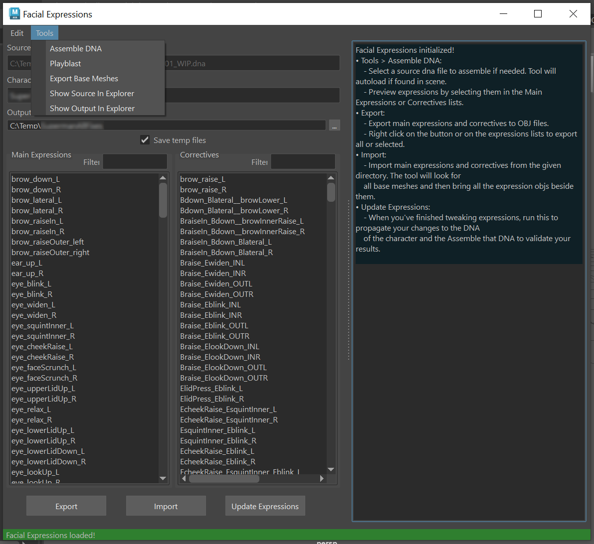

MetaHuman Facial Expressions - (Maya Python APY, PySide, DNA API, ZPlugins)
=============================================================================

All facial expressions and correctives in the MetaHuman DNA spec are controlled by two deformation layers: A skinning layer which controls most of the deformation and a blendshapes layer which is only used for finer detail in LOD0 by default. The joints are grouped in face regions and their transforms are encoded as slopes in dense matrices inside the DNA file format.

I've designed a set of tools and workflows to be able to fully manipulate all data encoded in the DNA file format, including non-destructive tweaking of expressions and correctives, automatic calculation of joint deformation from artistic input using skin decomposition and custom topology for non-humanoid characters.

